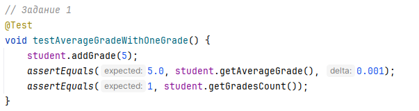
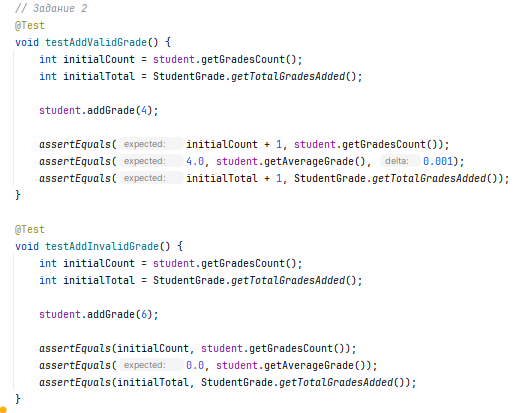
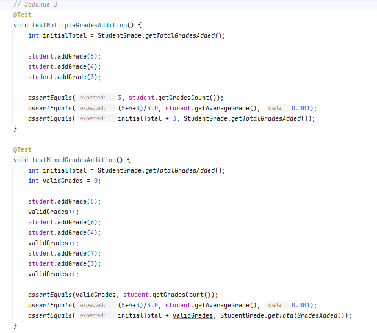
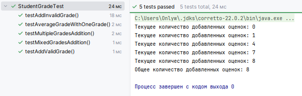

# Лабораторная работа №2_1: Тестовое окружение в JUnit

## 👨‍🎓 Студент
- **ФИО:** Егорова Дарья Антоновна
- **Группа:** 247
- **Вариант:** 4 (Оценка студента)

---

## ✅ Выполненные задания

### Задание 1 (Простое)
**Тест:** Используйте @BeforeEach для создания студента "Иванов". Добавьте одну оценку 5 и проверьте, что средний балл стал 5.0.

### Задание 2 (Среднее)
**Тесты:** Проверьте метод addGrade. Напишите два теста с использованием @BeforeEach:
Добавление корректной оценки 4 (количество оценок увеличивается).
Добавление некорректной оценки 6 (оценка не добавляется, количество не меняется).

### Задание 3 (Сложное)
**Тест:** Введите статический счетчик totalGradesAdded (всего добавленных оценок). С помощью @BeforeAll инициализируйте счетчик = 0. Каждый успешный вызов addGrade должен увеличивать счетчик на 1. С помощью @AfterEach проверяйте, что счетчик увеличился ровно на количество успешно добавленных оценок. С помощью @AfterAll выведите общее количество добавленных оценок.

---

## 📊 Результаты

---

## 📎 Ссылки
- [Код тестов](LAB2_1/src/test/java/StudentGradeTest.java)
- [Основной класс](LAB2_1/src/main/java/StudentGrade.java)

*Дата: 26.06.2026*
